# Architecture

Technical reference for the voice AI patient registration system. Every diagram
below describes code that exists in this repository — file and line references
are given so each claim can be checked against the source.

---

## 1. System context

Who talks to what, and over which protocol.

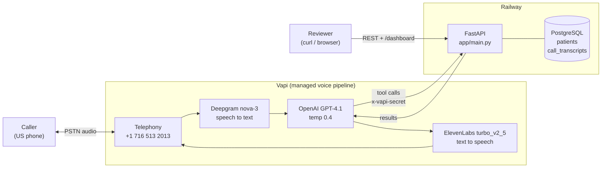

**Why a managed voice platform.** The assessment scores integration and system
design, not STT/TTS implementation. Vapi owns the realtime audio loop; this
repository owns the parts that are actually being evaluated — conversation
design, validation, persistence, and the API.

---

## 2. Layering and separation of concerns

Two entry points, one service layer, one set of validators. Nothing reaches the
database without passing through both.

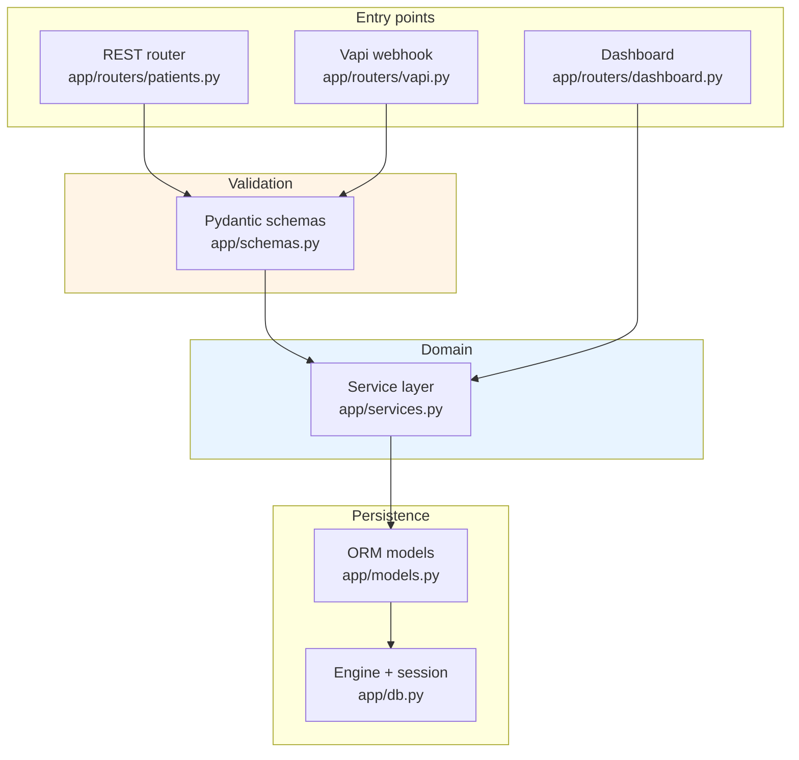

**The decision worth pointing at:** the voice agent does not call the public
REST API over HTTP. Both entry points import the same functions from
[`app/services.py`](../app/services.py). The PDF permits either
("use the REST API *or directly invoke the same service layer*"); calling the
service layer directly removes a network hop and, more importantly, makes it
structurally impossible for voice-path validation to drift from API-path
validation.

---

## 3. Registration call — end to end

Happy path for a new patient, from dial tone to persisted row.

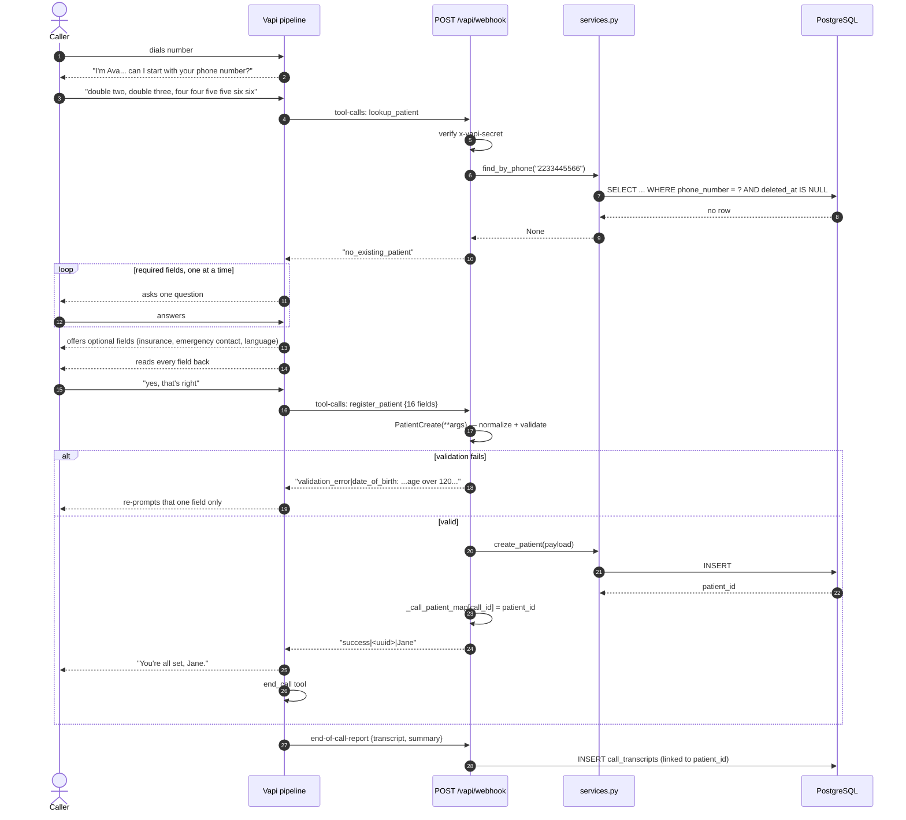

Steps 20–21 are the transcript bonus: `end-of-call-report` carries only the Vapi
call id, so [`app/routers/vapi.py:34`](../app/routers/vapi.py#L34) keeps a
`call_id -> patient_id` map populated during the tool call, letting the stored
transcript join back to the patient it created.

---

## 4. Returning caller — duplicate detection

The bonus challenge. Phone number is collected **first**, not last, precisely so
this branch can be taken before wasting the caller's time.

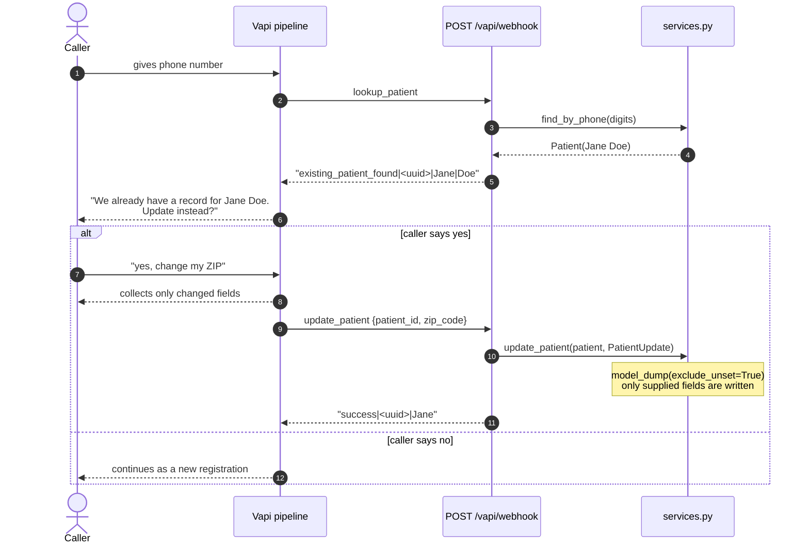

`exclude_unset=True` in [`app/services.py:63`](../app/services.py#L63) is what
makes partial updates safe: an omitted field stays untouched rather than being
overwritten with `None`.

---

## 5. Validation pipeline

The requirement is *"validate all inputs server-side (do not rely solely on the
voice agent for validation)"*. Everything below runs inside Pydantic, on both
entry points, before any SQL is issued.

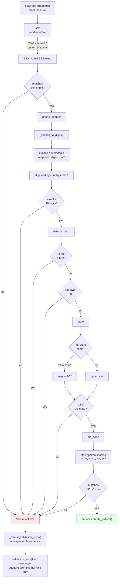

Each normalizer exists because a real call produced the failure it prevents:

| Heard on a live call | Naive result | Handled by |
|---|---|---|
| "double 1" | `1` | `_spoken_to_digits()` — [schemas.py:59](../app/schemas.py#L59) |
| "March fourth, eighteen ninety" | accepted, age 136 | `_check_dob()` — [schemas.py:108](../app/schemas.py#L108) |
| "Mail" | enum rejection | `SEX_ALIASES` — [schemas.py:36](../app/schemas.py#L36) |
| "New York" | rejected, wanted `NY` | `_normalize_state()` — [schemas.py:96](../app/schemas.py#L96) |
| "seven five five two three" | `"7 5 5 2 3"` | zip validator — [schemas.py:170](../app/schemas.py#L170) |

**The engineering point:** the LLM is treated as an untrusted input source. It
mishears, and its mistakes are systematic rather than random, so the server
corrects the systematic ones and rejects the rest with a message the agent can
read aloud.

---

## 6. Conversation state machine

The prompt in [`prompts/system_prompt.md`](../prompts/system_prompt.md) is
structured as an explicit flow rather than a wall of instructions.

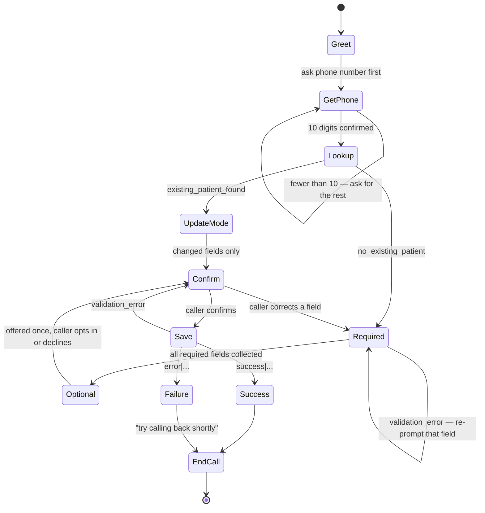

Two constraints encoded in the prompt map directly to evaluation criteria:

- **A correction returns to the field, not to the start.** The PDF asks what
  happens when a caller says *"actually my last name is D-A-V-I-S"*; the
  `Confirm → Required` edge is that answer.
- **`Failure` still reaches `EndCall` through speech.** The PDF asks whether a
  failed database write produces *"an error or silence"*. Every terminal state
  says something before hanging up.

---

## 7. Data model

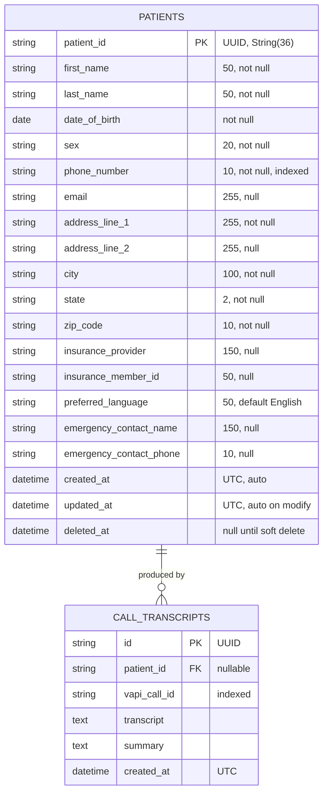

Three schema decisions worth defending in review:

1. **`patient_id` is `String(36)`, not a native `UUID` column.** The same model
   runs unmodified on SQLite (tests, local) and PostgreSQL (Railway). A native
   UUID type would have forced a dialect branch for no functional gain.
2. **`phone_number` is `String(10)` and indexed.** Digits only, no formatting —
   so `find_by_phone` is an exact-match index hit rather than a `LIKE` scan, and
   `(555) 123-4567` and `5551234567` cannot become two different patients.
3. **`sex` is `String(20)`, not a DB enum.** The allowed values live in the
   Pydantic `Sex` enum. A database enum would require a migration to add a
   value, and both write paths already pass through Pydantic.
4. **`deleted_at` rather than `DELETE`.** The PDF requires soft deletes; every
   read path filters `deleted_at IS NULL`
   ([services.py:30](../app/services.py#L30), [51](../app/services.py#L51)).

---

## 8. Request lifecycle and error envelope

Every response — success or failure — has the same shape.

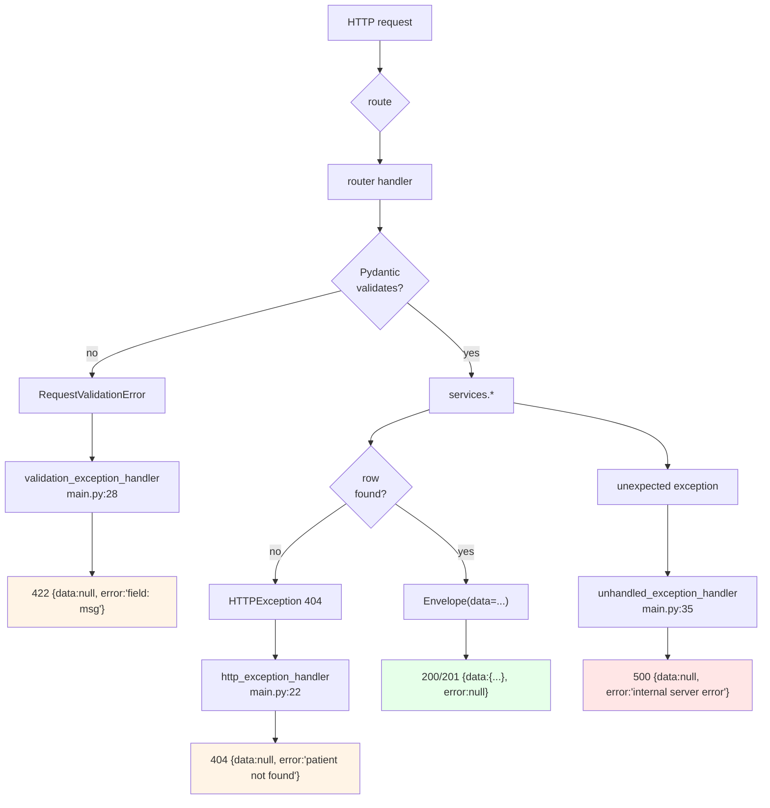

The three exception handlers in [`app/main.py:22-38`](../app/main.py#L22-L38)
exist so the envelope holds on error paths too — FastAPI's defaults would
otherwise return a bare `{"detail": ...}` and break the contract the PDF
specifies. The 500 handler deliberately returns a generic message while logging
the traceback: internal detail belongs in logs, not in responses.

---

## 9. Deployment and configuration

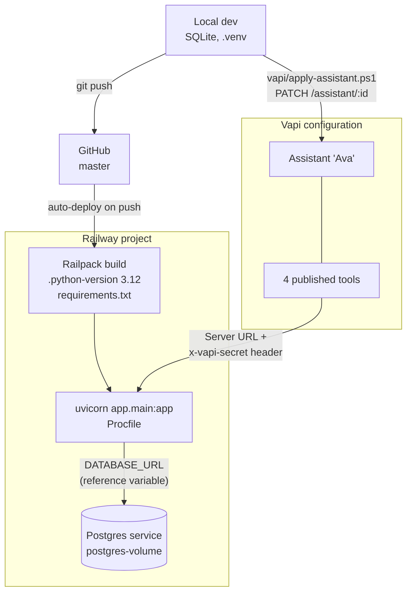

**Configuration as code.** The assistant's settings live in
[`vapi/assistant.json`](../vapi/assistant.json) and the prompt in
[`prompts/system_prompt.md`](../prompts/system_prompt.md);
[`vapi/apply-assistant.ps1`](../vapi/apply-assistant.ps1) pushes both to the
live assistant over the Vapi REST API. Voice configuration is version-controlled
and reviewable in a diff rather than existing only as dashboard state.

**Secrets.** `DATABASE_URL` and `VAPI_WEBHOOK_SECRET` are environment variables
([`app/config.py`](../app/config.py)); nothing is hardcoded. Every webhook
request is rejected unless `x-vapi-secret` matches
([`vapi.py:37`](../app/routers/vapi.py#L37)) — without it, the endpoint would
let anyone on the internet write patient rows.

**Driver choice.** `psycopg2` links `libpq` dynamically and the deploy image
does not ship it, so [`app/db.py`](../app/db.py) rewrites the connection scheme
to `postgresql+psycopg` and the project uses `psycopg[binary]`, whose wheels
bundle `libpq`. This removes the system dependency instead of working around it.

---

## 10. Voice pipeline tuning

Settings that exist because a specific live-call failure motivated them.

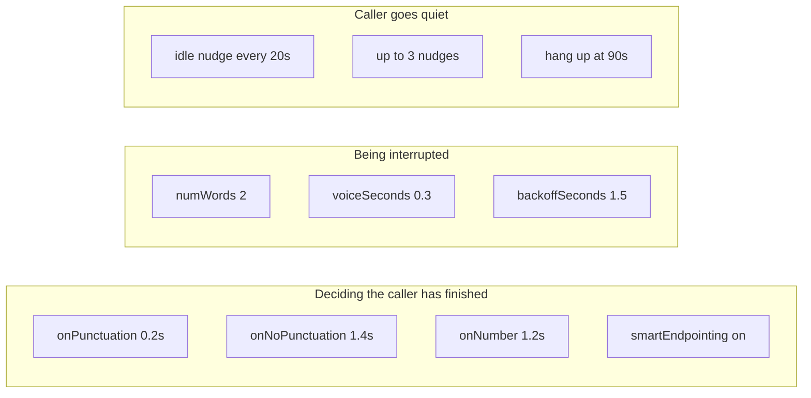

`onNumberSeconds` is the one that mattered most. Callers pause between digit
groups — *"triple five... one two three... four five six seven"* — and at the
default endpointing threshold the agent treated each pause as end-of-turn and
interrupted, which is why an emergency contact number once took four attempts.

Silence handling follows the same reasoning: the default is a single 30-second
timeout with no warning, so a caller who paused to find their insurance card got
hung up on. Three spoken nudges before a 90-second cutoff replaces that.

---

## 11. Test strategy

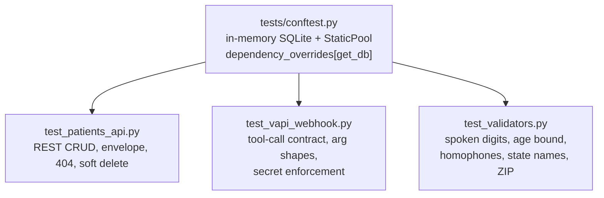

`StaticPool` keeps one connection alive so `:memory:` survives across requests
inside a test; an autouse fixture creates and drops tables per test so ordering
cannot leak state. Fixtures live in `conftest.py` specifically because
per-module setup previously caused one module to drop another's tables.

The validator tests are the ones worth reading — each case is a transcription
failure observed on a real call, not a hypothetical.

---

## 12. Known limitations

| Limitation | Consequence | What would change it |
|---|---|---|
| `_call_patient_map` is an in-process dict ([vapi.py:34](../app/routers/vapi.py#L34)) | Transcript↔patient linking breaks across multiple replicas or a restart mid-call | Persist the mapping, or key transcripts by `vapi_call_id` and reconcile later |
| No database migrations | Schema changes rely on `create_all` | Alembic |
| Seed data runs on every startup ([main.py:41](../app/main.py#L41)) | Only guarded by an emptiness check | Move to an explicit seed command |
| Deepgram still mishears spelled letters | Phonetic spelling ("D as in David") mitigates but does not eliminate | Constrained decoding or DTMF entry for critical fields |
| No auth on the REST API | Anyone with the URL can read patient rows | The PDF scopes HIPAA out; production would need auth |
